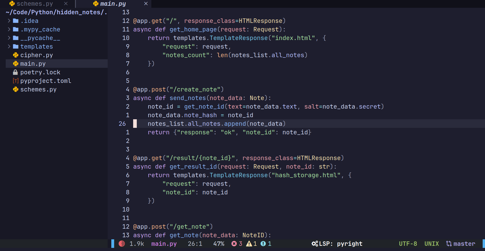
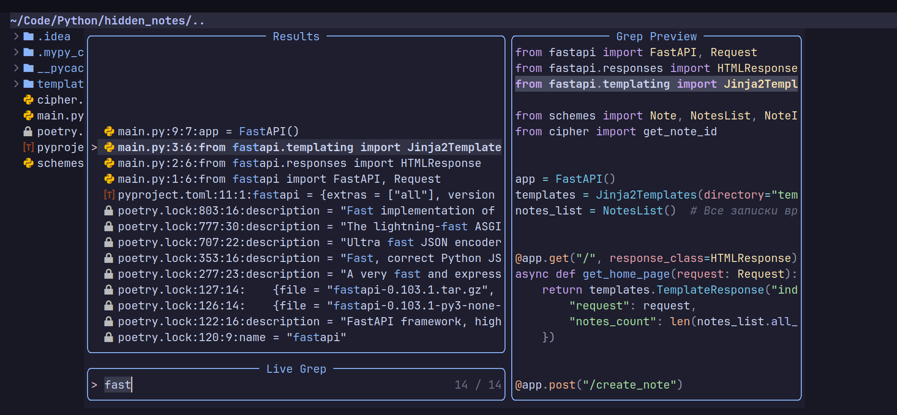
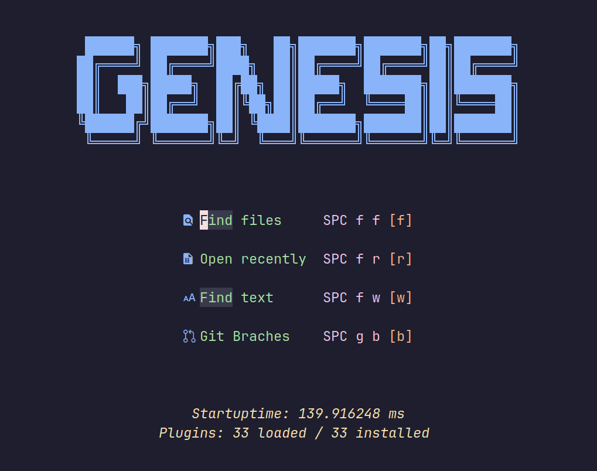
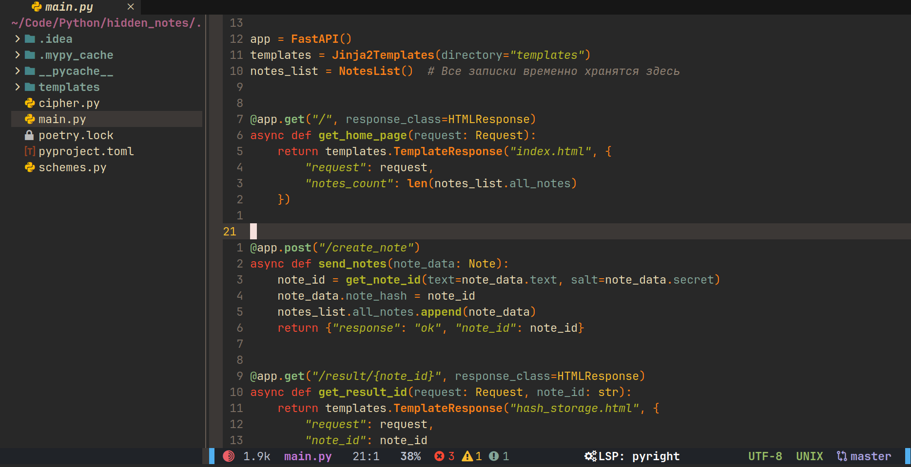
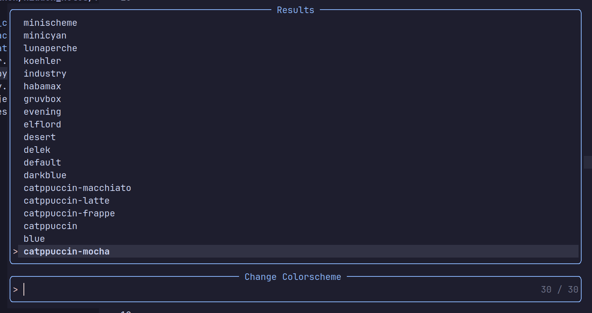

<h1 align="center">GenesisNvim</h1>

<h4 align="center">
  <a href="https://github.com/Zproger/GenesisNvim#-installation">Installation</a>
  ·
  <a href="https://www.youtube.com/@zproger">Youtube</a>
  ·
  <a href="https://t.me/codeblog8">Telegram</a>
</h4>

<p align="center">
A minimalistic nvim config aimed at Python developers. It is a lightweight replacement for PyCharm and VsCode, eliminating all unnecessary featuresd to be easily portable for running on servers and for deployment on Linux systems.
I created this fork to remove these errors https://github.com/Zproger/GenesisNvim/pull/19 and make it convenient for me. And thanks to Zproger for the great work
</p>

## 🌟 Preview










## 🌟 What it is?
- There are many forks of nvim, but what does this one do? The main purpose of this config is to create a minimal environment for Python development, so that it is not resource-hungry and can be deployed quickly on Linux systems.
- It can be difficult for beginners to install all the necessary plugins and LSP servers to get started. Here you don't need to do anything, just run a few commands to install and immediately use auto-tips, Ruff formatting, Mypy fixes and all the other tricks without setting up configurations.

## ✨ Features
- Python autocomplete with Pyright by default
- Support for default Ruff formatting and fixing
- Fast startup in just 140ms
- Catalog trees, support for TODO tags, navigation plugins, Git
- Support over 30 color schemes
- Support for diagnostics and LSP by default
- Built-in floating terminal that can be opened separately
- Quick search via Telescope
  
<details>
<summary><b>⌨️ HotKeys</b></summary>

### 1. General & Editor / Общие
| Shortcut | Action (EN) | Действие (RU) |
| :--- | :--- | :--- |
| **Ctrl + s** | Save current file | Сохранить текущий файл |
| **Ctrl + q** | Quit Neovim | Выйти из Neovim |
| **Ctrl + a** | Copy all to clipboard | Копировать всё в буфер |
| **j + k** / **j + j** | Exit Insert mode | Выход из режима вставки |
| **d** / **dw** / **dd** | Delete (no copy) | Удаление без копирования |
| **x** | Delete char (no copy) | Удаление символа без копирования |

### 2. Navigation & UI / Навигация
| Shortcut | Action (EN) | Действие (RU) |
| :--- | :--- | :--- |
| **Space + t** | Toggle File Tree | Открыть/Закрыть дерево файлов |
| **Space + t + f** | Focus on File Tree | Сфокусироваться на дереве |
| **Tab** | Next buffer | Следующая вкладка |
| **Shift + Tab** | Previous buffer | Предыдущая вкладка |
| **Ctrl + l** | Close other buffers | Закрыть остальные вкладки |

### 3. Search & Git / Поиск и Git
| Shortcut | Action (EN) | Действие (RU) |
| :--- | :--- | :--- |
| **Space + f + f** | Find files | Поиск файлов по названию |
| **Space + f + t** | Find text (Grep) | Поиск текста в файлах |
| **Space + f + b** | List buffers | Список открытых вкладок |
| **Space + c + s** | Change colorscheme | Смена цветовой схемы |
| **Space + g + b** | Git branches | Список веток Git |
| **Space + g + s** | Git status | Статус Git |
| **Space + n + l** | TODO/FIXME list | Список заметок TODO |

### 4. LSP & Diagnostics / Разработка
| Shortcut | Action (EN) | Действие (RU) |
| :--- | :--- | :--- |
| **g + d** | Go to Definition | Перейти к определению |
| **g + r** | List references | Найти все ссылки |
| **K** | Hover documentation | Документация под курсором |
| **Ctrl + k** | Signature help | Помощь по сигнатуре функции |
| **Space + r** | Code actions (Ruff) | Быстрые действия (Ruff) |
| **Space + f** | Format file | Форматирование кода |
| **Space + e** | Diagnostic float | Ошибка в плавающем окне |
| **[ + d** / **] + d** | Prev/Next diagnostic | К пред./след. ошибке |

### 5. Terminal & Utils / Терминал и утилиты
| Shortcut | Action (EN) | Действие (RU) |
| :--- | :--- | :--- |
| **Space + s** | Toggle terminal | Открыть терминал |
| **g + c + c** | Toggle line comment | Закомментировать строку |
| **g + c** | Toggle block comment | Закомментировать блок |
| **Escape** / **j + k** | Exit terminal mode | Выйти из режима терминала |

</details>

## 🌟 Installation
- If you already have neovim, make backups of your configuration.
- Remove the current nvim configuration and cache if it exists:

```sh
rm -rf ~/.config/nvim ~/.local/share/nvim ~/.local/state/nvim ~/.cache/nvim
```

- Execute the commands to install:

```sh
sudo pacman -S git npm  # Arch
sudo apt install git npm  # Debian
brew install git npm  # MacOS
```

```sh
mkdir -p ~/.config/nvim
git clone https://github.com/human624/genesis-vim-fork ~/.config/nvim
nvim -c "MasonInstall pyright ruff mypy debugpy rust-analyzer"
```

## 🌟 Other
- The project is ready for development, so I accept all your ideas. You can contact me or open `Issues` to make your edits or suggest improvements.
- To learn the tool key combinations, press `Space`, after the prompt, select the desired menu. To analyze and change key combinations, go to `~/.config/nvim/lua/core` and `~/.config/nvim/lua/plugins`.
- Video overview of this configuration: https://youtu.be/XhdwvHhFROc.
